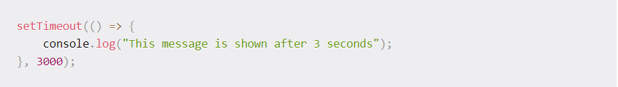

# DAY 1

## EVEBT LOOP:
 
   Javascript is single threaded programming language , single threaded runtime .
   Javascript has single callstacks.

   single threaded mean run piece of code at time .
  callstack is a data stracture which records basiclly where in the program we are .

   a function, we put somthing on the stack if we return from a function , we pop off the top of the stack.

  Blowing the stack it like infint loop .

   ### what happen when things are slow (bloking) ?
    **before what mean of slow ?** *it's just code that's slow*
    things are slow :
    - loop for one to billion
    - network requests
    - image request.

when we get API request we can not do anything until the request completed , to solve bloking problem we need asynchoronous callbacks , asynchonous does things that do not need time then those that need time.

   **Event loop** is responsible for executing the code , collection and processing event s and executing queued sub-tasks
   we get data from block of code if function need time like (**setTimeOut**) or (**API Request**) they are going to enter into *webapi* until completed then to queue then to stack then to console.

## JS callback functions

In JavaScript, functions are objects ,So, we can also pass functions as parameters to other functions and call them inside the outer functions

A function that is passed to another function as a parameter is a callback function 

we need callBack function , becuse sometime we need run something after something else,,Callbacks make sure that a function is not going to run before a task is completed but will run right after the task has completed.

Alternatively, we can define a function directly inside another function, instead of calling it, that named anonymous

**CallBack as an arrow functions**

you can also write the same callback function as an ES6 arrow function, which is a newer type of function in JavaScript:

also we can use callback function in event like botton.

##  JS Promises

Promises are used to handle asynchronous operations in JavaScript. They are easy to manage when dealing with multiple asynchronous operations where callbacks can create callback hell leading to unmanageable code.

Promises are the ideal choice for handling asynchronous operations in the simplest manner. They can handle multiple asynchronous operations easily and provide better error handling than callbacks and events. In other words also, we may say that, promises are the ideal choice for handling multiple callbacks at the same time, thus avoiding the undesired callback hell situation. Promises do provide a better chance to a user to read the code in a more effective and efficient manner especially it that particular code is used for implementing multiple asynchronous operations. 

**Benefits of Promises** 
1. Improves Code Readability
2. Better handling of asynchronous operations
3. Better flow of control definition in asynchronous logic
4. Better Error Handling

**A Promise has four states:**
1. fulfilled: Action related to the promise succeeded
2. rejected: Action related to the promise failed
3. pending: Promise is still pending i.e. not fulfilled or rejected yet
4. settled: Promise has fulfilled or rejected

**Promise Consumers**
Promises can be consumed by registering functions using *.then* and *.catch* methods.

- .then()

  then() is invoked when a promise is either resolved or rejected. It may also be defined as a career which takes data from promise and further executes it successfully.

- catch() 

  catch() is invoked when a promise is either rejected or some error has occurred in execution. It is used as an Error Handler whenever at any step there is a chance of getting an error.

**Applications** 

1. Promises are used for asynchronous handling of events.
2. Promises are used to handle asynchronous http requests.

## JS Async/Await

We all know that Javascript is a Synchronous which means that it has an event loop that allows you to queue up an action that won’t take place until the loop is available sometime after the code that queued the action has finished executing. But there’s a lot of functionalities in our program which makes our code Asynchronous. One of them is the Async/Await functionality.

**Async**:
It simply allows us to write promises based code as if it was synchronous and it checks that we are not breaking the execution thread. It operates asynchronously via the event-loop. Async functions will always return a value. It makes sure that a promise is returned and if it is not returned then javascript automatically wraps it in a promise which is resolved with its value.

**Await**:
Await function is used to wait for the promise. It could be used within the async block only. It makes the code wait until the promise returns a result. It only makes the async block wait.

## Test-Driven Development

### Testing

Testing is the process of ensuring a program receives the correct input and generates the correct output and intended side-effects.

You have two choices when it comes to testing: *manual testing* and *automated testing*.

**Manual Testing**

Manual testing is the process of checking your application or code from the user’s perspective. Opening up the browser or program and navigating around in an attempt to test functionality and find bugs.

**Automated Testing**

Automated testing, on the other hand, is writing code that checks to see if other code works. Contrary to manual testing, the specifications remain constant from test to test. The biggest advantage is being able to test many things much faster.

***I didn't have time to read the entire articles especially the last one due to family circumstances***
